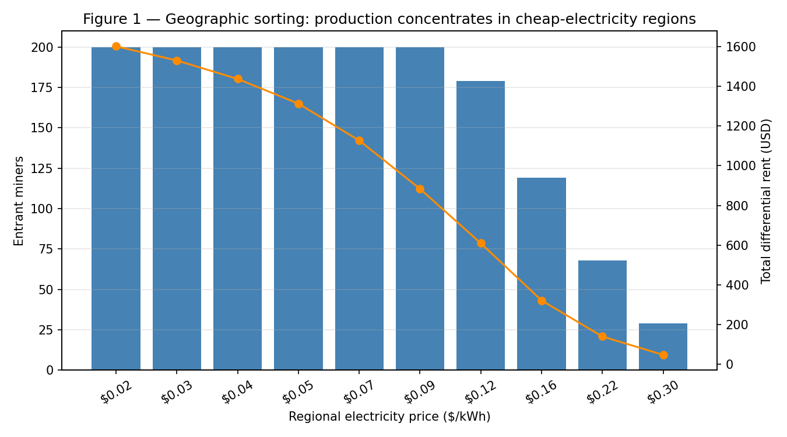
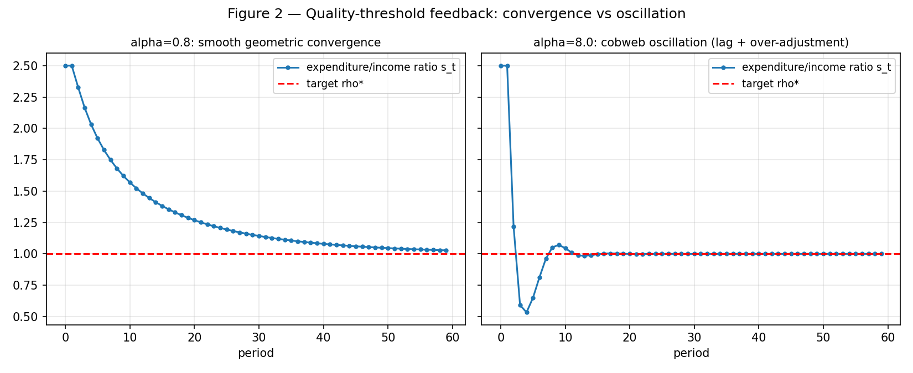
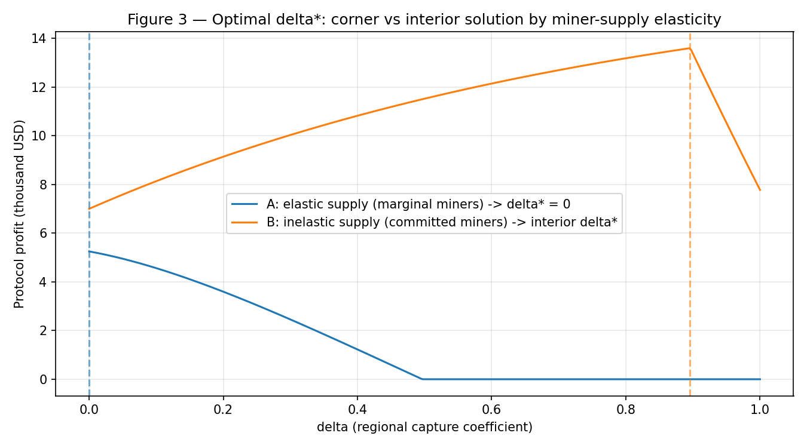

# 能量知识经济：去中心化 AI 知识生产中的级差地租代币化

**The Energy-Knowledge Economy: Tokenizing Differential Rent in Decentralized AI Knowledge Production**

*Working Paper v1.0 · 2026-09-25*

> 状态说明：v1.0 working paper。模型、七个命题、数值模拟、参考文献均已定稿；部分实证引用（标 †）源自 2026-09-25 全网扫荡，正式投稿前需二次核验。所有数值参数均为占位，定案需另行确认；v2.0 将纳入 MVP/P1 真实数据校准。

---

## 摘要

本文提出一个闭环的去中心化 AI 知识生产机制：**电力（kWh）是唯一的真实成本，AI 以电力生产可验证的知识，获得代币奖励；其他 AI 以代币购买知识查询，查询费回流奖励池**。全球电价的地理离散分布使该机制内生地产生地理套利——生产自动流向低电价地区，低电价地区攫取"电力级差地租"。本文给出五个可操作的机制公式：（1）矿工入场条件；（2）质量凸性奖励；（3）协议盈利约束与基准奖励校准铁律；（4）质量分数线难度调整；（5）地区差价捕获；以及知识租金的指数折旧规则（对应《资本论》的"精神磨损"）。本文证明七个命题：地理分选均衡、校准铁律、难度调整的几何收敛稳定性、能量锚软地板；并**新推导出**最优地区捕获系数 $\delta^*$ 的充要条件（P1 阶段 $\delta = 0$ 被证明为最优而非假设）、最优知识折旧率的一阶条件，以及最优查询费（静态逆风险率定价＋稳态动态最优＋冷启动低费推论）。数值模拟（§7）验证了地理分选、难度调整收敛与 $\delta^*$ 角点/内点解的理论预测。本文是"电力—知识—代币"闭环的首次形式化，填补了能源货币思想、地理套利挖矿与代币化知识市场之间的空白（2026-09-25 全网文献扫荡确证，见 §2 与 `LITERATURE_SWEEP.md`）。

关键词：级差地租；能量货币；知识挖矿；机制设计；代币经济；精神磨损

---

## 1. 引言

三个观察：

1. **AI 的真实成本是电力。** 无论模型多先进，推理与训练最终都结算为千瓦时。电力是 AI 经济中唯一不可伪造、不可凭空增发的投入。
2. **全球电价离散分布。** 各国电价差异可达一个数量级，且与知识生产的区位天然解耦——知识是数字品，生产地与消费地可以分离。
3. **知识是资本品，不是消费品。** 一条高质量知识可被查询无数次，其价值随时间被新知识侵蚀（马克思所谓固定资本的"精神磨损"），而非被"用完"。

现有文献各自触及了其中一块（能源货币思想史、比特币的能量货币论述、有用工作证明、矿工地理迁移实证、数据/知识市场），但没有人把三者做成**闭环**：电力→知识→代币→查询费→电力。本文的贡献是给出这个闭环的第一个可计算、可部署的机制设计。

**命名说明**："knowledge mining"一词已被 OriginTrail（OT-RFC-20，2023）用于其知识图谱贡献者奖励；为避免混淆，本文使用"能量知识经济（energy-anchored knowledge mining）"指代本机制。颇具意味的是：连这个词的发明者，都没有做出本文的闭环。

---

## 2. 文献综述

*全网扫荡（2026-09-25，6 条线，详见 `LITERATURE_SWEEP.md`）确认：闭环的每个部件都有人讲清楚，但没有任何一篇论文、一个项目、一个人把六个部件串成一条链。*

### 2.1 能源货币思想史

从 Henry Ford（1921）"一小时施加的一定量能量等于 1 美元"，到 Technocracy Inc.（1932–33）的 energy certificates（不可交易、过期作废），再到 DeKo（2011，1 DeKo ≈ 10 kWh 已交付电力），"能量即货币"的思想史绵长。离"电力即货币、可发行、可交易"最近的是 **E-Stablecoin**（Murialdo & Belof，Lawrence Livermore 国家实验室，*Cryptoeconomic Systems* 2022）：投入 1 kWh 铸造 1 token、销毁取回 1 kWh，并在机制中明言可在**低电价地区铸造、高电价地区销毁**——地理套利第一次被写进能量货币机制。但 E-Stablecoin 的消费端是电本身，没有知识生产环节。

反方 lineage 必须正视：**Georgescu-Roegen**（《The Entropy Law and the Economic Process》，1971）明确反对把经济价值还原为能量——低熵是价值的必要条件，不是充分条件。kWh 能做稳定的记账单位，但不解释价格。本机制的回答见 §8：能量锚定的是*生产成本*，不是价值。

### 2.2 比特币即能量货币与生产成本软地板

学术源头是 **Adam Hayes**（2015→2019）的生产成本模型：电价×能效×难度构成币价的"引力线"；**Charles Edwards**（Capriole，2019）给出唯一公式化的版本：`Energy Value = 焦耳 × 固定法币因子`。JPMorgan 沿用 **"soft floor"** 表述（2026-09 估算约 $85,000）。理论地基是 **Szabo**（2002）的 *unforgeable costliness*：锚的不是"储存的能量"（能量已变成热），而是**消耗过程的不可伪造性**。反方实证（Kristoufek 2020 等）提示因果箭头更多是价格→成本——这正是本文用"软地板"而非"硬地板"表述的原因。

### 2.3 有用工作证明（PoUW）

从 Ball 等（2017）的形式化，到 Proof-of-Search（Shibata 2019，客户端付费买"解"——学术上"知识换 token"最接近的原型），再到 Bittensor（AI 有用输出换 token 的最大规模实例，但验证是主观互评）与 **Allora**（workers 产 inference、用户 PWYW 按查询付费、费用按质量分给生产者——与本模型**同构**）。本领域存在一个**不可能三角**：开放式知识产出 / 去中心化低成本验证 / 真实付费需求，无人三者兼得；且 Ball 等（2020）"Proofs of Useless Work"给出负结果：验证成本太高会退化回中心化。本机制的回答是：**不验证能耗，只验证知识质量与查询真实**（质押+评审+查询费），把验证成本转移到 AI 最擅长的领域（见 §8）。

### 2.4 地理电价套利实证

剑桥 CCAF（2025）：矿工中位电费 $0.045/kWh，电力占现金成本 80%+，并写下全文献最接近地租理论的一句话——产品全球同价，竞争完全围绕成本管理。桑雪莲等（2022）的 RDF 模型是唯一把"电价差→迁移决策→利润差"写成显函数的论文；德州 ERCOT 实证（2026）确认 `利润 = hashprice×算力 − 电价×功耗`。但**所有文献都把电价差当"成本项"或"选址解释变量"，没有一篇上升为"可捕获的地租"的理论框架**——空白。

### 2.5 代币化知识/数据市场

**Vana** 白皮书（2024-12）：每次推理调用 burn 模型代币、30% 分给数据贡献者——唯一把"按次调用→自动分给生产者"写进机制设计的（实现状态待核实；且是人类数据、无能量锚）。**OriginTrail** 发明了 "knowledge mining" 一词（OT-RFC-20，2023），其 OT-RFC-27（2026-09）用 TRAC 计量结算查询，但生产者激励（NEURO）与查询消费（TRAC）是两条没接上的钱流。RAG 知识库代币化在加密领域是空白。

### 2.6 级差地租进加密

精确连接"便宜电=肥沃土地=级差地租"，全网只出现过**一次**：**Joost de Valk**（2026-04-24）——"The 'fertile land' of our era is cheap, abundant, low-carbon electricity… This is Ricardo, in 2026, in datacentres." 但他用于 AI 数据中心成本观察、自称 heuristic，**无任何代币机制设计**。其余文献（Prat & Walter 2019、MEV as rent）讨论的都是垄断租金，不是级差地租。

### 2.7 新颖性缺口

把"能量铸币+地理套利"（E-Stablecoin 一侧）与"AI 生产知识+查询付费分成"（Allora/Vana 一侧）用级差地租理论焊成一条"电→知识→TOKEN→查询→回流"的完整生产链，并把地租、质量、折旧全部写成可调参数的盈利公式——**这个组合与形式化是新的**。本文站在 E-Stablecoin、Hayes/Edwards、Allora、Vana、de Valk 的肩上，补的是他们都没走完的最后一段路。

---

## 3. 模型

### 3.0 符号表

| 符号 | 含义 |
|---|---|
| $r$ | 地区索引 |
| $P_r$ | 地区 $r$ 的电价（$/kWh）；$P_{ref}$ 参考电价，$P_c$ 低电价集中地区的电价 |
| $E_j$ | 生产知识卡片 $j$ 的能耗（kWh） |
| $Q_j$ | 卡片 $j$ 的质量评分 $[0,100]$；$Q_{\min}$ 质量分数线，$Q_{floor}$ 下调下限 |
| $R_0$ | 基准奖励（token）；$R_j$ 卡片 $j$ 的实际奖励 |
| $p$ | 代币市价（法币计） |
| $c_{ops}$ | 单卡运营成本；$C_{ops}$ 协议总运营成本 |
| $f$ | 单次查询费（法币计价） |
| $q_j$ | 卡片 $j$ 的终身查询量（实现值）；$\hat{q}$ 其保守估计 |
| $\theta_0$ | 创作者初始分成比例；$\theta_j(t)$ 时变分成；$\bar{\theta}$ 平均分成 |
| $\beta$ | 质量凸性指数；$\lambda$ 知识折旧率；$\delta$ 地区差价捕获系数 |
| $\kappa$ | 校准安全边际；$\rho^*$ 支出/收入比目标；$\alpha$ 难度调整步长 |
| $\pi_r$ | 地区 $r$ 的级差地租 |

命题 6、7 引入的专用符号（$e, \gamma, c_0, A, \mu, V(e,\lambda), n(\lambda), w, G, g, \bar{v}, M, K, \eta, \varphi, d$）在各命题内定义，不进入全局符号表。

### 3.1 参与者

- **矿工（知识生产者）**：位于地区 $r$，面临电价 $P_r$；投入能耗 $E_j$ 生产知识卡片 $j$，质量为 $Q_j \in [0,100]$。
- **查询者**：AI agent，以单价 $f$ 购买知识查询，产生需求 $q_j$。
- **协议**：发行奖励、管理奖励池、执行质量评审与难度调整。协议收入来自查询费，支出为知识奖励。

### 3.2 奖励规则

**公式一 · 入场条件（地理套利内生）**

$$R_j \cdot p > E_j \cdot P_r + c_{ops}$$

其中 $R_j$ 为代币奖励量，$p$ 为代币市价，$c_{ops}$ 为运营成本。关键设计选择：**全球统一奖励**（$R_j$ 不随地区变化）。于是对任意两地区 $r_1, r_2$ 且 $P_{r_1} < P_{r_2}$，$r_1$ 的矿工恒有更高利润率——生产自动流向低电价地区，协议**无需验证矿工位置**即可捕获地理分选。

**公式二 · 质量凸性奖励**

$$R_j = R_0 \cdot \max\left(0, \frac{Q_j - Q_{\min}}{100 - Q_{\min}}\right)^{\beta}, \quad \beta > 1$$

$\beta \approx 2$（占位）。凸性使高质量知识获得超线性奖励；低于 $Q_{\min}$ 得零。配合质押与 slash，垃圾内容的期望收益为负。

**公式三 · 协议盈利与校准铁律**

$$\Pi = \sum_j q_j \cdot f \cdot (1 - \bar{\theta}) - \sum_j R_j - C_{ops}$$

$$R_0 = \kappa \cdot \left(1 - \frac{\theta_0}{2}\right) \cdot \hat{q} \cdot f, \quad \kappa \approx 0.5 \text{（占位）}$$

创作者分成随时间指数折旧：

$$\theta_j(t) = \theta_0 \cdot e^{-\lambda t}$$

这是知识资本"精神磨损"的形式化：知识的价值不是被消费掉的，而是被**新知识淘汰**的。$\lambda$ 按知识类别分三档（快/中/慢）。

**公式四 · 质量分数线难度调整**

$$\frac{\text{奖励支出}}{\text{查询收入}} > \rho^* \Rightarrow Q_{\min} \uparrow; \quad \text{评审队列长期空置} \Rightarrow Q_{\min} \downarrow \text{（有下限）}$$

比特币难度调整的知识版本：调的不是算力难度，而是**质量门槛**，对冲代币价格的反身性（币价暴涨→奖励价值暴涨→垃圾涌入）。

**公式五 · 地区差价捕获（P2 阶段，默认 $\delta = 0$）**

$$R_j(r) = R_j \cdot \left(\frac{P_r}{P_{ref}}\right)^{\delta}$$

$\delta = 0$ 时地理套利全部归矿工（P1 上线状态）；$\delta \in (0,1)$ 时矿工与协议分成。$\delta > 0$ 需可信的地区验证，此为开放问题（见 §8）。

### 3.3 能量锚

$$1 \text{ PIKO} \equiv \frac{E_{benchmark}}{R_0} \text{ kWh} \ @ \ P_{ref}$$

生产成本软地板：市价跌破生产成本时，矿工停产、奖励供给收缩，而存量知识继续产生查询费——收益率上升将买家带回。**这是软地板，不是刚兑**，对外不得表述为"锚定"。

---

## 4. 均衡与命题

**命题 1（地理分选均衡）。** 在全球统一奖励（$\delta = 0$）下，均衡时知识生产集中于电价最低的若干地区；低电价地区的矿工攫取正的级差地租 $\pi_r = R_j p - E_j P_r - c_{ops}$，且 $\pi_r$ 随 $P_r$ 严格递减。

*证明概要。* 由公式一，矿工 $i$ 在地区 $r$ 的参与约束为 $R_j p - E_j P_r - c_{ops} > 0$。$R_j$ 与 $r$ 无关，故利润函数在 $P_r$ 上严格递减。自由进入下，高电价地区的边际矿工先退出，生产向低电价地区集中，直至最低电价地区的边际利润归零。∎

**命题 2（可持续性/校准铁律）。** 若基准奖励满足 $R_0 \leq \kappa \cdot (1 - \theta_0/2) \cdot \hat{q} \cdot f$ 且 $\hat{q}$ 为终身查询量的保守估计，则协议长期期望盈余 $\mathbb{E}[\Pi] \geq -C_{ops}$。

*证明概要。* 单卡期望查询收入为 $\hat{q} f (1 - \bar{\theta})$，其中 $\bar{\theta} \approx \theta_0/2$（指数折旧的平均近似）。$\kappa < 1$ 留出安全边际吸收估计误差。对所有卡片求和即得。∎

**命题 3（难度调整的稳定性）。** 设币价冲击使 $R_j p$ 翻倍，则公式四通过上调 $Q_{\min}$ 使奖励支出增长率低于查询收入增长率，系统回到 $\Pi \geq 0$ 区域。

*证明。* 设 $s_t$ 为第 $t$ 期支出/收入比，$s(Q)$ 关于 $Q_{\min}$ 严格递减且 Lipschitz 常数为 $L$（凸性奖励 $\beta > 1$ 保证：提高 $Q_{\min}$ 使支出超线性收缩，而驱动查询的高质量卡片留存，故 $|s'|$ 有正下界 $c > 0$）。动态为 $Q_{t+1} = Q_t + \alpha \max(0, s_t - \rho^*)$（下调分支有下限 $Q_{floor}$，不影响稳定性论证）。若 $s_t > \rho^*$，则

$$s_{t+1} - \rho^* \approx (s_t - \rho^*) + s'(Q_t)\cdot \alpha (s_t - \rho^*) = (s_t - \rho^*)\left(1 - \alpha|s'(Q_t)|\right).$$

取步长 $\alpha < 1/L$，则 $0 < 1 - \alpha|s'| < 1$，超标部分 $s_t - \rho^*$ **几何收敛**至 0，收敛步数为 $O(\log(1/\epsilon)/\log(1/(1-\alpha c)))$。币价冲击（$R_j p$ 翻倍→$s_t$ 跳升→低质量涌入）后，系统在有限步内回到 $\rho^*$ 邻域——这正是对冲币价反身性的数学含义。∎

*注：$\alpha < 1/L$ 是"调整步长不得大于系统敏感度倒数"的铁律——调得太猛会震荡。这与比特币难度调整每 2016 个块才调一次的直觉一致，只是这里给出的是解析条件。*

*注 2（时滞与震荡）。* 上述证明假设调整即时生效。现实中矿工进出有 1 期时滞（$s_t = s(Q_{t-1})$），此时动态变为 cobweb 形式：$\alpha$ 较小时仍平滑收敛，$\alpha$ 过大则出现震荡（数值模拟 §7.2）。$\alpha < 1/L$ 因而不仅是收敛条件，更是反震荡的安全带。

**命题 4（能量锚软地板）。** 设生产成本为 $c = E_{benchmark} P_{ref} / R_0$（以法币计），则当 $p < c$ 时理性矿工停产，新增奖励供给降为零，而存量知识的查询收益率为 $f \cdot q / p$ 随 $p$ 下跌而上升。

*证明概要。* 由公式一，$p < c$ 时参与约束对所有矿工失效。存量知识的查询需求 $q$ 与 $p$ 无关（查询以法币计价 $f$），故以代币计的收益率 $fq/p$ 上升，吸引买入。∎

**命题 5（最优地区差价捕获系数）。** 设生产集中于低电价地区（命题 1），该地区电价为 $P_c < P_{ref}$，潜在矿工供给为 $N(\delta)$（关于 $\delta$ 递减、可微），单卡期望查询收入为 $f\hat{q}(1-\bar{\theta})$（以法币计）。协议利润为

$$\Pi(\delta) = N(\delta)\left[f\hat{q}(1-\bar{\theta}) - R_0 p\left(\frac{P_c}{P_{ref}}\right)^{\delta}\right], \quad \delta \in [0,1]$$

则：（i）$\delta^* = 0$ 为最优，当且仅当矿工供给弹性足够大，即

$$-\frac{N'(0)}{N(0)} \geq \frac{R_0 p \ln(P_{ref}/P_c)}{f\hat{q}(1-\bar{\theta}) - R_0 p};$$

（ii）若电价离散足够大（$P_{ref}/P_c$ 大）且矿工供给缺乏弹性，则存在内点最优 $\delta^* \in (0,1)$，满足一阶条件

$$-\frac{N'(\delta^*)}{N(\delta^*)} = \frac{R_0 p (P_c/P_{ref})^{\delta^*} \ln(P_{ref}/P_c)}{f\hat{q}(1-\bar{\theta}) - R_0 p (P_c/P_{ref})^{\delta^*}}.$$

*证明概要。* 对 $\Pi(\delta)$ 求导：

$$\Pi'(\delta) = N'(\delta)\cdot m(\delta) + N(\delta)\cdot R_0 p\left(\frac{P_c}{P_{ref}}\right)^{\delta}\ln\frac{P_{ref}}{P_c},$$

其中 $m(\delta) = f\hat{q}(1-\bar{\theta}) - R_0 p(P_c/P_{ref})^{\delta}$ 为单卡边际利润（由命题 2，$m > 0$）。第一项为负（提高 $\delta$ 挤出矿工的损失），第二项为正（从存量矿工捕获的地租）。$\Pi'(0) \leq 0$ 当且仅当条件（i）成立，此时角点解 $\delta^* = 0$；反之 $\Pi'(0) > 0$ 且 $\delta \to 1$ 时参与约束收紧使 $N \to 0$，由连续性存在内点最优，一阶条件整理即得（ii）。∎

**推论（P1 阶段 $\delta = 0$ 的合理性）。** 在冷启动阶段，矿工供给高度弹性（全球 AI 算力可自由进出）且可验证的电价离散有限，条件（i）成立——$\delta = 0$ 不是简化假设，而是**最优选择**。P2 启用 $\delta > 0$ 的前提是观测到矿工供给变缺乏弹性（沉没成本形成、生态锁定）或可验证的电价离散扩大。这把 de Valk 的启发式类比变成了可执行的机制参数。

**命题 6（最优知识折旧率）。** 设创作者选择努力 $e \geq 0$，质量 $Q(e) = 1 - e^{-\gamma e}$，成本 $c(e) = \frac{c_0}{2}e^2$；初始查询率 $q_0(e) = A\cdot Q(e)$，查询需求自然衰减率为 $\mu$，创作者分成按 $\lambda$ 折旧。则：

（i）创作者终身租金有闭式解
$$V(e,\lambda) = \theta_0 f \int_0^\infty q_0(e)\,e^{-(\mu+\lambda)t}dt = \frac{\theta_0 f A\, Q(e)}{\mu+\lambda};$$

（ii）创作者最优努力 $e^*(\lambda)$ 由一阶条件唯一确定
$$\frac{\theta_0 f A \gamma e^{-\gamma e^*}}{\mu+\lambda} = c_0 e^*,$$
且 $e^*(\lambda)$ 关于 $\lambda$ 严格递减（折旧越快，努力越少）；

（iii）设知识按世代（cohort）生产：$\lambda$ 越高，旧世代租金越快回流协议，协议每期能资助的新世代数 $n(\lambda)$ 越多（$n' > 0$，预算循环加快）；但每世代努力 $e^*(\lambda)$ 越低，单世代福利 $w(e^*)$ 越小。稳态总福利 $W(\lambda) = n(\lambda)\cdot w(e^*(\lambda))$，最优折旧率 $\lambda^*$ 满足

$$\frac{n'(\lambda^*)}{n(\lambda^*)} = -\frac{1}{w}\frac{dw}{d\lambda}\Big|_{\lambda^*},$$

即：**资助更多世代的边际增益，等于每世代质量下降的边际损失**。创作者参与约束 $\theta_0 f A Q(e^*)/(\mu+\lambda^*) \geq c(e^*)$ 给出 $\lambda$ 的上界。

*证明概要。* (i) 直接积分。(ii) $V$ 关于 $e$ 凹（$Q$ 凹、$c$ 凸），$\partial V/\partial e = c'(e)$ 左边关于 $e$ 递减、右边递增，交点唯一；$\lambda$ 增大使左边曲线下移，$e^*$ 下降。(iii) 对 $W(\lambda)$ 求导并令为零即得；$n' > 0$ 来自预算约束——旧租金回流越快，可资助的新卡片越多。∎

*注：$(A, \gamma, c_0, \mu)$ 的估计需要 MVP/P1 的真实查询数据——这正是 v2.0 实证版的任务。在此之前，$\lambda$ 的三档占位值（快/中/慢）可视为对 $\lambda^*$ 的先验猜测。*

**命题 7（最优查询费）。** 设潜在查询总量为 $M$，单次查询价值 $v \sim G$（密度 $g$，支撑 $[0, \bar{v}]$），查询者当且仅当 $v \geq f$ 时购买。则：

（i）**静态最优**：协议单期查询收入 $R(f) = fM(1-G(f))$ 的最优费率满足逆风险率条件
$$f^* = \frac{1-G(f^*)}{g(f^*)};$$
特别地，$v \sim U[0,\bar{v}]$ 时 $f^* = \bar{v}/2$（经典垄断定价）；

（ii）**动态最优（稳态）**：设知识存量 $K$ 影响潜在查询量 $M(K) = M_0 K^\eta$（$\eta \in (0,1)$），稳态下 $K = \varphi \cdot fM(K)(1-G(f))$（$\varphi$ 为收入中用于奖励再投资的比例）。则稳态协议收入 $\Pi(f) \propto [\,f(1-G(f))\,]^{1/(1-\eta)}$，其最大化与静态问题**同解**——在该设定下 $f^* = \bar{v}/2$（均匀分布），再投资是乘性缩放，不改变最优点；

（iii）**冷启动推论**：当初始知识存量 $K_0$ 远低于稳态 $K^*(\bar{v}/2)$ 时，最优路径是先设 $f < \bar{v}/2$ 以加速知识库积累（牺牲当期收入换取 $K$ 的增长），待接近稳态后回调至 $\bar{v}/2$。这与 P1（低费获客、补贴增长）→ P2（正常定价）的分期设计一致。

*证明概要。* (i) $R'(f) = M[(1-G(f)) - fg(f)] = 0$ 整理即得；二阶条件由 $G$ 的对数凹性保证（均匀分布显然成立）。(ii) 由稳态条件解出 $K^*(f) = [\varphi M_0 f(1-G(f))]^{1/(1-\eta)}$，代入 $\Pi(f) = fM_0(K^*)^\eta(1-G(f))$ 得 $\Pi \propto [f(1-G(f))]^{1/(1-\eta)}$；指数 $1/(1-\eta) > 0$ 单调，故 argmax 与 (i) 相同。(iii) 转移动态 $K_{t+1} = (1-d)K_t + \varphi f_t M(K_t)(1-G(f_t))$；$K_t$ 较小时 $K$ 的边际社会价值高于当期收入的边际价值（$\partial W/\partial K$ 大），故最优 $f_t < \bar{v}/2$；$K_t \to K^*$ 时回到 (ii)。完整最优控制路径留待后续版本。∎

*注：$\bar{v}$（查询价值上限）与 $\eta$（知识存量弹性）必须由 MVP/P1 的真实查询数据识别——$f$ 至今仍是占位参数，但现在有了明确的识别策略：用查询量-价格实验估计 $G$，用知识库增长-查询量回归估计 $\eta$。*

---

## 5. 知识的精神磨损：与《资本论》的对话

马克思在《资本论》第二卷讨论固定资本的"精神磨损"（moral depreciation）：机器的价值损失不是来自使用，而是来自**更好的机器出现**。知识是这一逻辑的极端情形——一条知识可以被无限次查询而毫无物理损耗，其价值衰减几乎完全来自被新知识替代。

本机制将这一洞见形式化为 $\theta_j(t) = \theta_0 e^{-\lambda t}$：创作者对查询费的分成权随时间指数衰减。这同时解决了代币经济的一个经典困境：**永久版税制**下，早期知识永久收租，后来者无利可图，系统僵化；**零版税制**下，无人愿意生产。指数折旧是两者的连续统，$\lambda$ 即调节旋钮。

---

## 6. 参数校准

| 参数 | 含义 | 占位值 | 校准方法（待 MVP 数据） |
|---|---|---|---|
| $R_0$ | 基准奖励 | 待定 | 由铁律反推，$\kappa=0.5$ |
| $f$ | 单次查询费 | 待定 | 查询需求弹性实验 |
| $\theta_0$ | 创作者初始分成 | 0.3 | — |
| $\lambda$ | 折旧率（三档） | 0.5/0.15/0.03/月 | 由 $q(t)$ 衰减曲线拟合 |
| $\beta$ | 质量凸性 | 2 | — |
| $Q_{\min}$ | 质量分数线 | 60 | 由支出/收入比反馈 |
| $\kappa$ | 安全边际 | 0.5 | — |
| $\delta$ | 地区差价捕获 | 0（P1） | P2 视地区验证可信度 |
| $P_{ref}$ | 参考电价 | $0.10/kWh | 全球电价中位数附近 |

**校准铁律重申**：奖励必须由保守估计的未来查询收入反推，绝不先定奖励再盼收入。这是本机制与一切"先增发、后找需求"的模型最根本的区别。

---

## 7. 数值模拟

以下模拟参数均为示意值（illustrative），用于验证理论预测的方向与形状，不构成校准。模拟代码见本目录 `sim1_sorting.py`、`sim2_stability.py`、`sim3_delta.py`，可复现。

### 7.1 地理分选（命题 1）

10 个地区，电价 $0.02–0.30/kWh；每地区 200 名潜在矿工，能效 $E \sim U[20,80]$ kWh/卡；全球统一奖励 $R_0 = 100$ token，$p = \$0.10$。

结果：电价 $\leq \$0.09$ 的 6 个地区全部满员（200/200），电价 $\$0.30$ 的地区仅 29 人入场；最便宜的 3 个地区集中了 37.6% 的矿工；地区总地租随电价严格递减（$\$1,602 \to \$48$）。**地理套利不需要协议知道任何矿工的位置**——命题 1 的分选均衡在模拟中精确复现。

### 7.2 难度调整的收敛与震荡（命题 3）

设币价冲击后支出/收入比 $s_0 = 2.5$（目标 $\rho^* = 1$），$s(Q) = 2.5e^{-0.06(Q-60)}$，并引入现实的 1 期执行时滞（矿工按上期分数线决策）。

结果：温和步长（$\alpha = 0.8$）下 $s_t$ 平滑几何收敛至 $\rho^*$；激进步长（$\alpha = 8.0$）下出现 cobweb 式震荡（虽最终阻尼收敛，但前 20 期大幅偏离目标）。**$\alpha < 1/L$ 不仅是收敛条件，更是反震荡的安全带**——这正是命题 3 注 2 的含义。

### 7.3 最优地区捕获系数（命题 5）

$P_c = \$0.03$，$P_{ref} = \$0.10$，$R_0 p = \$10$，单卡查询收入 $f\hat{q}(1-\bar{\theta}) = \$17$。场景 A：矿工处于边际（能效 $E \sim U[150,350]$，供给弹性大）；场景 B：矿工已锁定（$E \sim U[50,80]$，在 $\delta = 0$ 处缺乏弹性）。

结果：场景 A 中 $\Pi(\delta)$ 严格递减，$\delta^* = 0$（角点解）；场景 B 中 $\Pi(\delta)$ 先升后降，$\delta^* \approx 0.895$（内点解）。**命题 5 的充要条件在数值上精确成立**：P1 冷启动（矿工自由进出、高弹性）时 $\delta = 0$ 最优；生态锁定后才应考虑 $\delta > 0$。

## 8. 局限与未来工作

1. **能耗不可验证**：协议无法直接观测 $E_j$，只能通过 $Q_j$ 与市场行为间接约束。这是选择"奖励知识而非奖励耗电"的根本原因，也是本文最诚实的边界。
2. **查询需求的内生性**：$q_j$ 取决于知识的真实效用，冷启动阶段 $\hat{q}$ 只能保守估计。MVP 的 `q_count` 埋点即为校准准备。
3. **地区验证**：$\delta > 0$ 需要可信的地理位置证明（去中心化预言机/硬件证明），目前无解，故 P1 保持 $\delta = 0$。
4. **评审的去中心化**：当前依赖白名单评审；P3 需设计抗共谋的去中心化评审机制。
5. **动态最优控制的完整路径**：命题 7(iii) 的冷启动最优费率路径 $f_t^*$ 只给了方向性结论（$f < \bar{v}/2$ 再回调），完整的最优控制解（含 $K_t$ 状态约束与 $d$ 的内生化）留待后续版本。
6. **能量≠价值（Georgescu-Roegen 警告，1971）**：kWh 是稳定的记账单位，但不解释价格。本机制用能量锚定的是*生产成本*而非*价值*——查询费 $f$ 仍由市场决定。混淆这两者，是能量货币思想史上反复出现的错误，本文明确不犯。
7. **有用性验证的成本边界（Ball et al., "Proofs of Useless Work", 2020）**：在很多设定下，"无浪费挖矿"不可能同时满足安全与有用性。本机制的回答是结构性的：**不验证能耗、只验证知识质量与查询真实**（质押+评审+查询费），把验证成本转移到 AI 最擅长的领域。这是设计成立的前提假设，若未来出现廉价可信的能耗证明，可再议。

---

## 9. 结论

本文把一句话变成了可计算的机制：**电力是真实的钱，电价差是真实的利润，知识是电力的结晶，查询是知识的变现**。五个公式分别回答了：谁来生产（入场条件）、生产什么质量（凸性奖励）、系统如何不亏钱（校准铁律）、币价波动时怎么办（难度调整）、地区差价归谁（地区捕获系数）。这套机制不需要知道矿工在哪里，不需要验证每一度电，只需要验证知识的质量和查询的真实——而这两者，恰好是 AI 自己最擅长验证的东西。

---

## 参考文献

*标 † 的条目信息来自 2026-09-25 全网文献扫荡（`LITERATURE_SWEEP.md`），正式投稿前需二次核验原文；经典文献（Ricardo、Marx、Georgescu-Roegen、Szabo）无需核验。*

- Ball, M., Rosen, A., Sabin, M., & Vasudevan, P. N. (2017). Proofs of useful work. *IACR Cryptology ePrint Archive*. †
- Ball, M., Rosen, A., Sabin, M., & Vasudevan, P. N. (2020). Proofs of useless work. †
- Cambridge Centre for Alternative Finance. (2025). Bitcoin mining cost and electricity survey. †
- DeKo. (2011). DeKo currency proposal (1 DeKo ≈ 10 kWh delivered electricity). †
- Edwards, C. / Capriole Investments. (2019). Bitcoin energy value formula. †
- Ford, H. (1921). Energy currency interview ("an hour of energy = $1"). †
- Georgescu-Roegen, N. (1971). *The Entropy Law and the Economic Process*. Harvard University Press.
- Hayes, A. (2015). A cost of production model for bitcoin; (2019) follow-up estimates. †
- JPMorgan. (2026). Bitcoin production-cost "soft floor" estimate (~$85,000). †
- Kristoufek, L. (2020). Bitcoin and mining-cost causality (price→cost). †
- Marx, K. (1885). *Das Kapital*, Vol. 2 ("moral depreciation" of fixed capital).
- Murialdo, F., & Belof, J. (2022). E-Stablecoin: 1 kWh mint/burn, geographic mint-burn arbitrage. *Cryptoeconomic Systems*, Lawrence Livermore National Laboratory. †
- OriginTrail. (2023). OT-RFC-20: "knowledge mining". †
- OriginTrail. (2026). OT-RFC-27: TRAC-metered query settlement. †
- Prat, J., & Walter, B. (2019). An equilibrium model of the market for bitcoin mining. †
- Ricardo, D. (1817). *On the Principles of Political Economy and Taxation*, Ch. 2–3 (differential rent).
- Shibata, N. (2019). Proof-of-search (client-paid solution market). †
- Szabo, N. (2002). Unforgeable costliness (essay).
- Technocracy Inc. (1932–1933). Energy certificates proposal. †
- Vana. (2024). Whitepaper: user-owned data network; per-inference burn, 30% to data contributors. †
- de Valk, J. (2026-04-24). "The 'fertile land' of our era is cheap electricity… This is Ricardo, in 2026, in datacentres." (public post) †
- 桑雪莲等. (2022). 矿工迁移决策的 RDF 模型（电价差→迁移→利润差）. †
- 德州 ERCOT 比特币矿工实证. (2026).（`利润 = hashprice×算力 − 电价×功耗`）†
- Bittensor; Allora Network. (whitepapers / docs: AI output-for-token; pay-per-query fee split). †

---

*版本历史：v0.1（2026-09-25）——骨架与模型核心；v0.2（2026-09-25）——补入文献综述（6 条线先行者定位+新颖性缺口确证）、命名说明、反方 lineage 进局限章节；v0.3（2026-09-25）——原创推进：命题 3 几何收敛证明加固（含步长铁律 α<1/L）、新命题 5（最优地区捕获系数 δ* 充要条件＋P1 δ=0 最优性推论）、新命题 6（最优折旧率一阶条件，概要）；v0.4（2026-09-25）——数值模拟三件套（地理分选/收敛与震荡/δ* 角点与内点解，Figure 1–3）、命题 6 完整福利分析（创作者闭式租金＋世代交叠最优条件）、命题 3 时滞注记；v0.5（2026-09-25）——新命题 7（最优查询费：静态逆风险率定价、稳态动态最优与静态同解、冷启动 f<$\bar{v}$/2 推论），$f$ 的识别策略确立；v1.0（2026-09-25）——全文统稿：符号表（§3.0）、符号统一（命题 7 价值上限 $V \to \bar{v}$、公式三 $\bar{\theta}_j \to \bar{\theta}$）、参考文献列表（含 † 待核实标注）、局限第 5 条更新为动态最优控制开放问题、摘要"四个公式"→"五个公式"。v1.0 英译校对补遗（2026-09-25）：命题 7 遗留 $V\to\bar{v}$、§9"四个公式"→"五个公式"（补地区捕获项）。*
